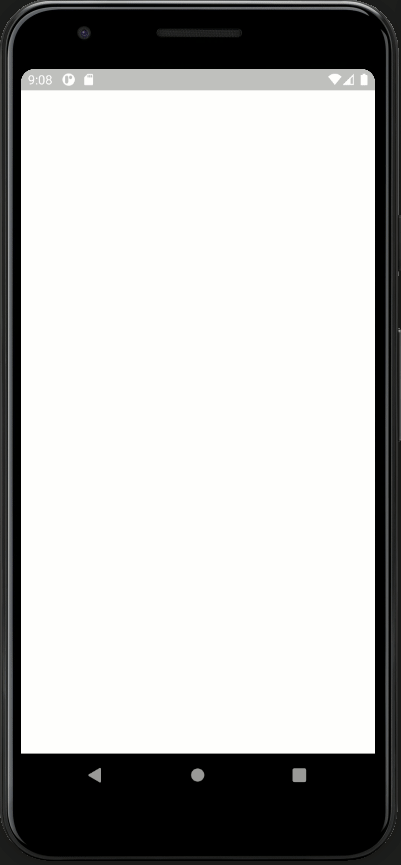

# gctviewer

Connect to GoCryptoTrader using its gRPC interface

## Introduction

GCTViewer is a multi-platform gRPC based app that acts as a visual interface to GoCryptoTrader.
GoCryptoTrader is a cryptocurrency trading bot supporting multiple exchanges written in Golang.

**GCTViewer is created to experiment with mobile platforms, gRPC and GoCryptoTrader.** It is at this point in no way
designed or intended to be used beyond experimentation.



## Getting Started

This project is a starting point for building a Flutter application on top of [GoCryptoTrader](https://github.com/thrasher-corp/gocryptotrader/).

A few resources to get you started if this is your first Flutter project:

- [Lab: Write your first Flutter app](https://flutter.dev/docs/get-started/codelab)
- [Cookbook: Useful Flutter samples](https://flutter.dev/docs/cookbook)

For help getting started with Flutter, view our
[online documentation](https://flutter.dev/docs), which offers tutorials,
samples, guidance on mobile development, and a full API reference.

## Preparation

Install and configure Dart and Flutter following their official guides:

- [Install Dart](https://dart.dev/get-dart)
- [Install Flutter](https://flutter.dev/docs/get-started/install)

Do not forget to run `flutter doctor` and be sure to setup a mobile phone emulator as described in the Flutter manual.

## Compiling, configuring and running

Retrieve and prepare GCTViewer as follows:

```console
git clone https://github.com/Talta/gctviewer.git
cd gctviewer
flutter pub get
```

### Configuration

To connect GCTViewer to GoCryptoTrader, it needs to be configured with GoCryptoTrader's connection details as
specified in GoCryptoTrader's remoteControl section in its config.json. A sample configuration file is provided in
`assets/cfg/config_sample.json`. Copy this file to `assets/cfg/config.json` and edit the connection details.

```console
cp ./assets/cfg/config_sample.json ./assets/cfg/config.json
```

GCTViewer also needs to be provided the TLS public key for connecting to GoCryptoTrader's gRPC channel. Copy the
TLS certificate from GoCryptoTrader's config folder to GCTViewer's config.

Assuming the default GoCryptoTrader config folder is used, the certificate file is copied as follows:
```console
cp ~/.gocryptotrader/tls/cert.pem ./assets/cfg/cert.pem
```

### Running

One way to run the app is through an emulator connected to Flutter. Identify a device ID to use in the emulator:

```console
flutter emulators
flutter emulators --launch <emulator-ID>
````

Run GCTViewer on an attached device:

```console
flutter devices
flutter run -d <device-ID> lib/main.dart
```

Alternatively, the gctview folder can be opened as a project in Android Studio or in Visual Studio Code, after which
the emulator and the app can be run through the IDE.

## Protobuf

Optionally, update the protocol buffer Dart code by generating the Dart files based on GoCryptoTrader's .proto file. See:
- [Protocol Buffers - Dart Generated Code](https://developers.google.com/protocol-buffers/docs/reference/dart-generated)
- [GoCryptoTrader gRPC Service](https://github.com/thrasher-corp/gocryptotrader/tree/master/gctrpc)
- [Using Flutter with a gRPC backend](https://medium.com/flutter-community/flutter-grpc-810f87612c6d)

Note that in addition to GoCryptoTrader's protobuffer files, GCTViewer needs Google's timestamp protobuffer files.

Install the Dart plugin for the protoc compiler:
```console
git clone https://github.com/dart-lang/protobuf/ dart-lang_protobuf
cd dart-lang_protobuf/protoc_plugin
pub install
```

And optionally:
```console
pub global activate protoc_plugin
```

Compile updated dart include files, and move them to the GCTViewer source tree `./lib/model/grpc/`:
```console
protoc -I=. -I=$GOPATH/src -I=$GOPATH/src/github.com/grpc-ecosystem/grpc-gateway/third_party/googleapis --dart_out=grpc:$GCTVIEWERPATH/lib/model/grpc/ rpc.proto
```

The Dart plugin for the protoc compiler does not include the needed include files for timestamps, as documented [here on Github](https://github.com/protocolbuffers/protobuf/issues/5678). Although unlikely the include files need updating soon, a [manual process](https://github.com/grpc/grpc-dart/issues/76) is available. E.g.:
```console
protoc -I=$GOPATH/src/github.com/grpc-ecosystem/grpc-gateway/third_party/googleapis --dart_out=grpc:$GCTVIEWERPATH/lib/model/grpc/ /usr/include/google/protobuf/timestamp.proto
```

## Links

GCTViewer is written while exploring the many excellent Flutter and Dart tutorials by the Flutter and Dart teams:
- [Flutter Cookbook](https://flutter.dev/docs/cookbook/)
- [Flutter in Focus YouTube playlist](https://www.youtube.com/playlist?list=PLjxrf2q8roU2HdJQDjJzOeO6J3FoFLWr2)
- [Dart tutorials](https://dart.dev/tutorials)

Dart has a gRPC plugin, with limited support from its creators. There are however some excellent community provided
tutorials and examples to exploit its possibilities and work around the limitations.
- [Dart gRPC helloworld example](https://github.com/grpc/grpc-dart/tree/master/example/helloworld)
- [Flutter asynchronous chat client](https://medium.com/flutter-community/tutorial-asynchronous-flutter-chat-client-with-go-chat-server-which-are-powered-by-grpc-simple-ce913066861c)
- [Using Flutter with a gRPC backend](https://medium.com/flutter-community/flutter-grpc-810f87612c6d)
- [ServiceStack gRPC protoc Flutter Dart Client - including SSL connections](https://docs.servicestack.net/grpc-flutter)